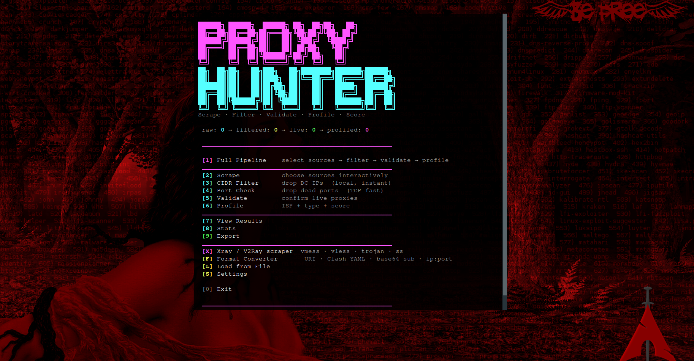

# ProxyHunter v2

A proxy discovery and validation toolkit that combines multiple public sources with intelligent filtering and profiling.

---

## Overview

ProxyHunter is a community-driven tool for scraping, validating, and profiling residential proxies. It aggregates data from GitHub repositories, public APIs, Telegram channels, HTML pages, and accessible .onion sites—helping identify working proxies and classify their characteristics.

The workflow is straightforward: **scrape → filter → validate → profile → score**. The result is useful data: ISP information, geolocation, latency metrics, and a quality score to help you understand each proxy's characteristics.

Designed to be modular, accessible, and easy to extend or modify for your needs.

---

## Features

## Features

- **Multiple data sources** — GitHub lists, proxy APIs, Telegram channels, Gist searches, HTML tables, accessible .onion sites
- **Flexible filtering** — Choose source tiers (T1: stable, T2: moderate, T3: experimental) based on your tolerance for risk
- **Datacenter filtering** — Remove known cloud provider and datacenter IP ranges (AWS, Azure, Google Cloud, etc.)
- **Concurrent validation** — Parallel threaded checks validate proxies against real HTTP endpoints
- **Geolocation and ISP data** — Query `ip-api.com` to classify proxies and identify their characteristics
- **Quality scoring** — Simple 0-100 scale based on latency, type (residential/mobile/datacenter), and hosting status
- **Xray/V2Ray support** — Parse and validate vmess, vless, trojan, ss subscription links and export to standard formats
- **Format conversion** — Convert between ip:port notation, URI schemes, base64 subscriptions, and Clash YAML
- **Session management** — Load previously scraped proxies, export results in various formats
- **Interactive interface** — Menu-driven TUI with real-time progress and statistics

---

## Demo / How to Use

### Start the hunt

```bash
python3 proxyhunterV2.py
```

You'll see a banner. It checks your exit IP (VPN/DC detection). Press enter.

### Main Menu

```
[1] Full Pipeline    — scrape sources → filter DC → check ports → validate → profile
[2] Scrape           — choose sources interactively (preset: Quick/Standard/Full)
[3] CIDR Filter      — drop known datacenter IPs locally (instant)
[4] Port Check       — TCP connect test; drop dead ports
[5] Validate         — HTTP proxy test via test URLs
[6] Profile          — ISP lookup, classification, scoring
[7] View Results     — table of live proxies with scores
[8] Stats            — breakdown by type, country, source
[9] Export           — save as txt, json, or by filter (residential/mobile)
[X] Xray Menu        — separate pipeline for Xray nodes
[F] Format Converter — convert between URI, base64, Clash YAML
[L] Load from File   — import previously scraped proxies
[S] Settings         — adjust threads, timeouts, protocols
```

### Example: Quick hunt

1. Select **[1] Full Pipeline**
2. Choose **[Q] Quick** preset (GitHub T1 + APIs only, ~100-500 proxies)
3. Wait for scrape summary
4. Wait for CIDR filtering (drops ~20% datacenter)
5. Port check (~30% fail immediately)
6. HTTP validation (test URLs; ~10-20% survive)
7. ISP profiling (batch geo lookup)

**Result:** ~50-200 live residential proxies with scores 40-95.

Export as `proxies.txt`, use in your automation.

### Interface



---

## Customization

### Modifying Sources

All proxy sources are defined in `constants.py`. You can add, remove, or modify sources by editing the relevant lists:

- **SOURCES_GITHUB** — GitHub repositories with proxy lists (tiered: T1, T2, T3)
- **SOURCES_API** — Public proxy APIs (e.g., proxyscrape, geonode)
- **TELEGRAM_CHANNELS** — Public Telegram channels to scrape
- **SOURCES_HTML** — Websites with HTML tables containing proxies
- **SOURCES_TOR** — .onion sites (requires Tor proxy setup)
- **XRAY_TELEGRAM_CHANNELS** — Telegram channels for Xray/V2Ray subscriptions
- **SOURCES_XRAY_SUB** — GitHub repositories with Xray subscription links

To add a new source:
1. Open `constants.py`
2. Add your URL to the appropriate list (e.g., `SOURCES_GITHUB['T3'].append('https://github.com/new/repo/raw/main/proxies.txt')`)
3. Restart the tool

For Xray sources, ensure URLs point to raw text files containing vmess/vless/trojan/ss URIs or base64-encoded subscriptions.

**Note:** Test new sources carefully—some may be unreliable or contain invalid data. Use the interactive source selection menu to enable/disable sources during runtime.

**Lines of Code** (v2 refactored modular architecture):

| Module | Lines | Role |
|--------|-------|------|
| proxyhunterV2.py | 653 | TUI & orchestration |
| xray_handler.py | 298 | Xray parsing & export |
| scraper.py | 276 | Multi-source scraping |
| constants.py | 177 | Sources, keywords, CIDRs |
| format_converter.py | 114 | Format conversions |
| validator.py | 102 | Port/HTTP validation |
| profiler.py | 77 | ISP profiling & scoring |
| filters.py | 69 | CIDR filtering |
| ui.py | 57 | TUI display |
| state.py | 32 | Session state |
| **TOTAL** | **1,855** | — |

**Source Coverage:**

- **30+ GitHub proxy repos** (tiered: quality vs experimental)
- **11 proxy APIs** (geonode, proxyscrape, openproxy)
- **13 Telegram channels** (proxy lists + user channels)
- **7 HTML scrapers** (free-proxy-list.net, sslproxies, etc.)
- **3 Tor .onion sites** (pastebin, strongbox, ZeroNet)
- **20+ Xray aggregators** (V2Ray configs, vmess/vless/trojan/ss URIs)

**Datacenter CIDR blocks covered:** 150+ ranges (AWS, Azure, Google Cloud, DO, Linode, Hetzner, OVH, etc.)

---

## Technical Details

### Architecture

```
proxyhunterV2.py    ← Interactive TUI (menu-driven)
    ├── scraper.py       (GitHub, API, Telegram, HTML, Tor)
    ├── filters.py       (CIDR network checking)
    ├── validator.py     (TCP port, HTTP proxy test)
    ├── profiler.py      (ISP lookup, classify, score)
    ├── xray_handler.py  (Xray URI parsing, export)
    ├── format_converter.py (URI ↔ base64 ↔ YAML)
    ├── state.py         (Session data holder)
    ├── constants.py     (Sources, keywords, regexes)
    └── ui.py            (Colors, progress bars)
```

### Threading Model

- **Scraping:** 20 threads per source (configurable)
- **Port check:** 200 threads, 1.5s timeout (configurable)
- **Validation:** 50 threads, 8s timeout per proxy (configurable)
- **Profiling:** batch queries to `ip-api.com` (100 per batch, rate-limited 1.4s between batches)

### Proxy Classification

Based on ISP, organization, and hosting flags:

- **Residential** — ISP names (Comcast, AT&T, Verizon, etc.)
- **Mobile** — Cellular carriers (T-Mobile, Sprint, O2, etc.)
- **Datacenter** — Cloud providers and hosting companies
- **Unknown** — No clear match

### Scoring (0-100)

```
speed_score = 40 (if latency < 0.5s) ... 0 (if > 5s)
type_score  = 40 (residential) | 35 (mobile) | 20 (unknown) | 5 (datacenter)
hosting_bonus = 20 (if not in datacenter CIDR)
total = min(100, speed + type + hosting)
```

### Dependencies

```
requests >= 2.25
colorama >= 0.4
requests[socks]  (optional, for Tor)
```

### Session State

- `raw_proxies` — scraped, unfiltered
- `filtered` — post-CIDR, post-port-check
- `valid` — HTTP-validated with latency
- `profiled` — with ISP, country, type, score
- `xray_nodes`, `xray_filtered`, `xray_alive`, `xray_profiled` — Xray pipeline parallels

---

## Technical Stack

- **Language:** Python 3.7+
- **Concurrency:** ThreadPoolExecutor (concurrent.futures)
- **HTTP:** requests library
- **Geo-IP:** ip-api.com (batch endpoint)
- **Parsing:** regex, base64 decoding, JSON extraction
- **UI:** Colorama for cross-platform ANSI colors

---

## License & Credits

**License:** Unlicensed (public domain / use at your own discretion)

**Acknowledgments:**

- Proxy list sources: monosans, elliottophellia, UptimerBot, jetkai, TheSpeedX, ShiftyTR, roosterkid, and community contributors
- API providers: proxyscrape, geonode, openproxy
- Xray aggregators: mahdibland, barry-far, peasoft, Leon406, mfuu, freefq, and the broader V2Ray ecosystem
- Geolocation: ip-api.com

---

## Contributing & Disclaimer

This tool is provided as-is for educational and testing purposes. Proxy quality varies significantly based on sources, timing, and geographic factors. Results depend heavily on source selection and validation settings.

**Status:** Active project. Bugs, feature requests, and improvements are always welcome. If you encounter issues or have ideas for enhancements, feel free to report them or submit a pull request.

Contributions are welcome adding new data sources, improving validation logic, expanding format support, fixing bugs, or optimizing performance. The modular architecture makes it straightforward to extend or improve individual components.

**Use responsibly and in compliance with applicable terms of service and laws.**

---

```
╲╲╲▕▏╭━━━━╮▕▏╱╱╱
╲╲╲▕▏┃┏━━┓┃▕▏╱╱╱
╲╲╲▕▏┗╯╭━┛┃▕▏╱╱╱
╱╱╱▕▏┊┊┃┏━╯▕▏╲╲╲
╱╱╱▕▏┊┊┗╯┊┊▕▏╲╲╲
╱╱╱▕▏┊┊┏┓┊┊▕▏╲╲╲
╱╱╱▕▏┊┊┗╯┊┊▕▏╲╲╲
```

## A Thought

> *In the theater of anonymity, every proxy is a player, every connection a performance. The stage is set. Your move determines the ending.*
>
> *Every revelation is a choice. Every choice echoes.*
